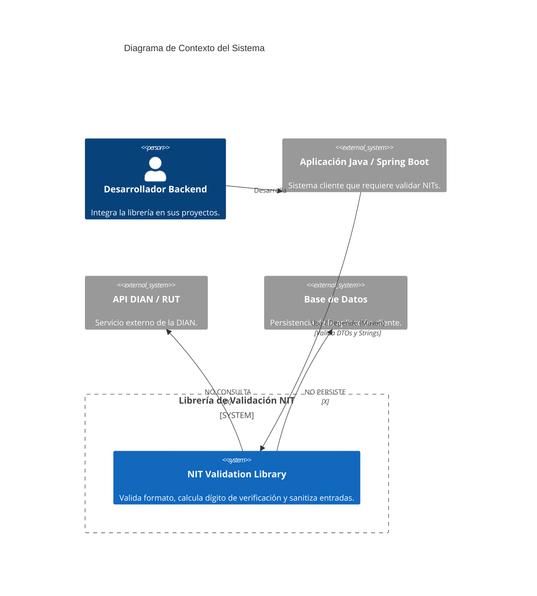
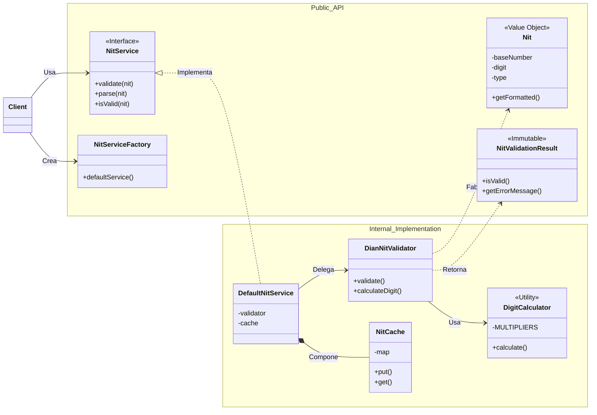

# Arquitectura del Sistema - Diagramas UML

Este documento presenta la visión arquitectónica de la librería mediante diagramas UML (Mermaid), destacando límites, responsabilidades y flujos de datos.

## 1. Diagrama de Contexto (Alcance)

Muestra quién consume la librería y los límites claros de lo que hace y lo que NO hace.



## 2. Diagrama de Componentes y Flujo Principal

Describe cómo interactúan los módulos internos cuando un cliente solicita una validación.

```mermaid
graph TD
    subgraph "Cliente (Consumer)"
        ClientApp[Aplicación Cliente]
        DTO[DTO con @Nit]
    end

    subgraph "Módulo Spring Boot Starter (Integración)"
        Aspect[NitServiceAspect]
        ValidatorAdapter[NitValidator (Bean Validation)]
        Advice[NitRestControllerAdvice]
    end

    subgraph "Módulo NIT Core (Dominio Puro)"
        PublicAPI[<<Interface>>\nNitService]
        Impl[DefaultNitService]
        Cache[NitCache (LRU)]
        Algorithm[DianNitValidator]
        Math[DigitCalculator]
        Domain[<<Value Object>>\nNit]
    end

    %% Relaciones
    ClientApp -->|Inyecta| PublicAPI
    DTO -.->|Valida via| ValidatorAdapter
    
    ValidatorAdapter -->|Delega| PublicAPI
    Aspect -->|Intercepta| PublicAPI
    
    PublicAPI -->|Implementa| Impl
    Impl -->|Consulta| Cache
    Impl -->|Usa| Algorithm
    Algorithm -->|Calcula| Math
    Algorithm -.->|Crea| Domain

    %% Estilos
    style ClientApp fill:#f9f,stroke:#333,stroke-width:2px
    style PublicAPI fill:#69f,stroke:#333,stroke-width:2px,color:white
    style Domain fill:#6f9,stroke:#333,stroke-width:2px
```

## 3. Diagrama de Clases (Estructura Pública vs Interna)

Muestra qué clases son visibles para el usuario y cuáles son detalles de implementación encapsulados.



## 4. Matriz de Responsabilidades

| Componente | Responsabilidad Principal | Lo que NO hace |
| :--- | :--- | :--- |
| **NitService** | Punto de entrada único para todas las operaciones. | No conoce los detalles matemáticos del Módulo 11. |
| **DianNitValidator** | Orquestar la validación y aplicar reglas de negocio (longitud, formato). | No mantiene estado ni caché. |
| **DigitCalculator** | Matemática pura del algoritmo Módulo 11. | No valida formatos ni tipos, solo calcula números. |
| **Nit (Domain)** | Representar un NIT válido e inmutable. | No permite estados inválidos. No tiene setters. |
| **Starter (Spring)** | Integrar la librería con el ecosistema Spring (Beans, AOP). | No contiene lógica de negocio del dominio. |

## 5. Límites del Sistema

*   **Sin Estado Persistente:** La librería no guarda datos en disco ni bases de datos. El caché es puramente en memoria volátil.
*   **Sin Conectividad Externa:** No realiza llamadas HTTP, REST ni SOAP a la DIAN o servicios de terceros. Funciona 100% offline.
*   **Sin Interfaz Gráfica:** No provee widgets ni componentes UI, es una librería de backend.
